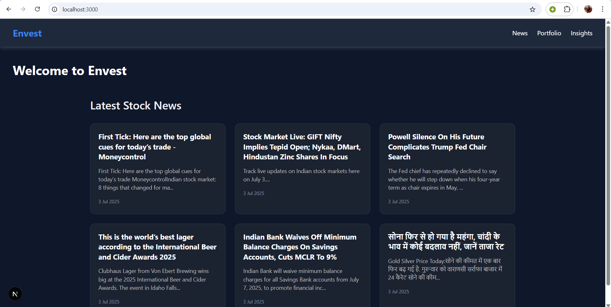
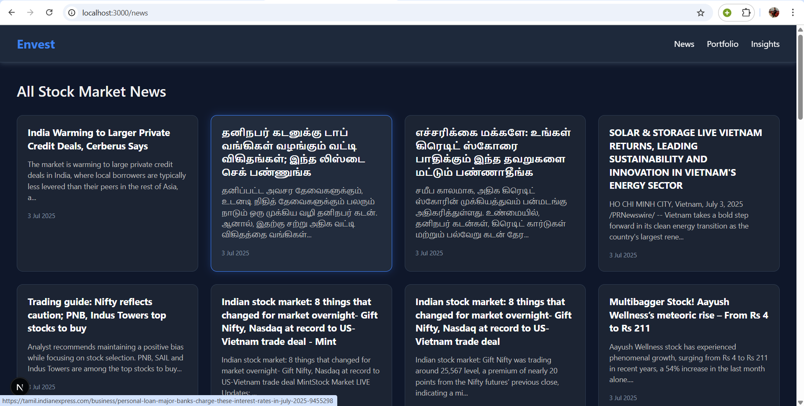
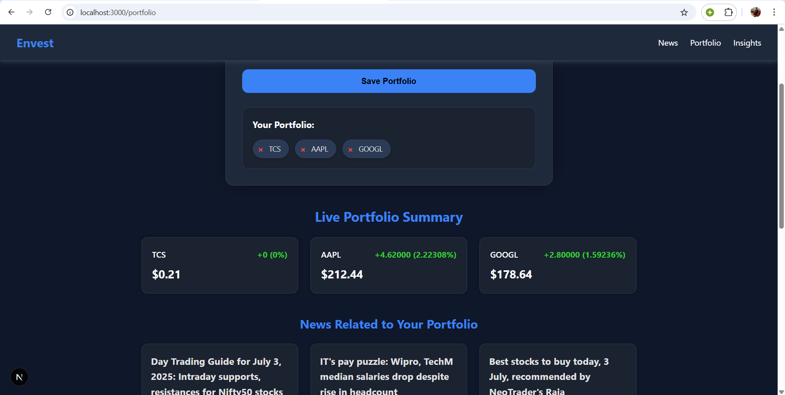
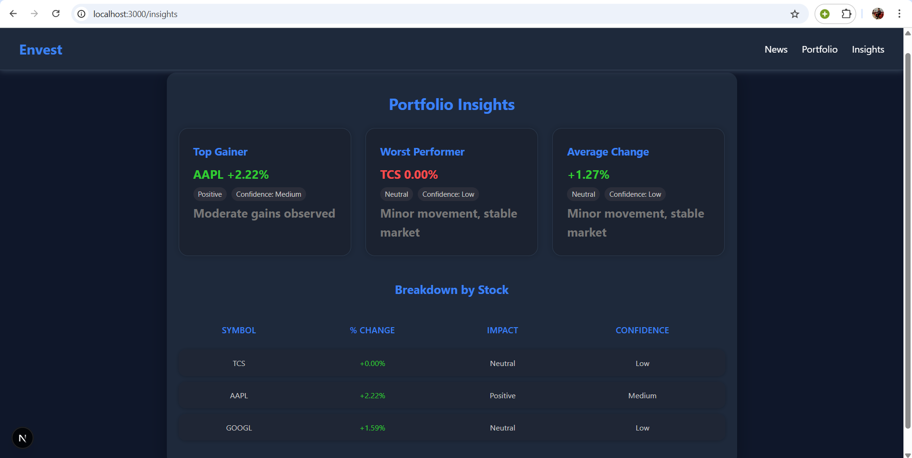

# Envest

**Envest** is a sleek, modern stock portfolio insights and news platform. Users can input stock symbols, get live market summaries, view curated financial news, and access AI-ready insights — all within a polished and professional UI built from scratch.

## Tech Stack

- **Frontend**: Next.js, React, TypeScript
- **Styling**: CSS Modules
- **Backend**: Next.js API Routes
- **State Management**: Context API
- **APIs**:
  - [Twelve Data API](https://twelvedata.com/) – for real-time stock quotes
  - [NewsData.io](https://newsdata.io/) – for curated stock news

## Demo

## Features

### 1. Portfolio Summary

Input stock symbols to get real-time price, change %, and currency details.

### 2. Curated News

Latest stock-related news from trusted financial sources.

### 3. Smart Insights

AI-ready insights like average movement, extreme changes, and alerts based on portfolio activity.

### 4. Responsive UI

Clean, intuitive, and responsive dark-themed UI — uniquely crafted for this platform.

---

## Screenshots

### Home Page

### News Page

### Portfolio Page

### Insights Page

---

## Made By

[@ToushifAlam](https://github.com/ToushifAlam)
